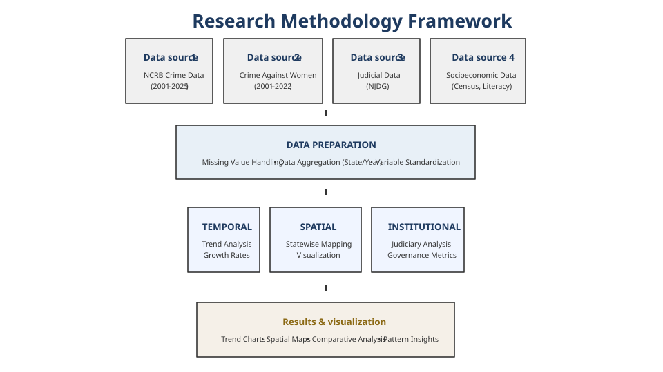
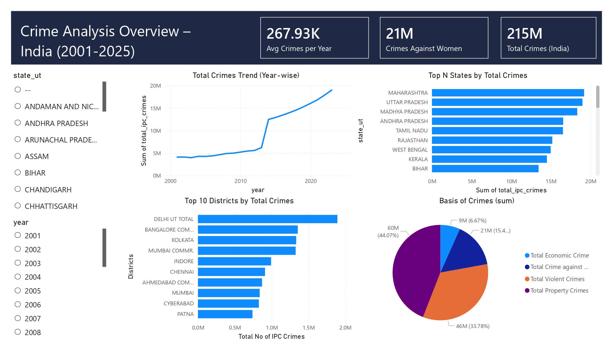
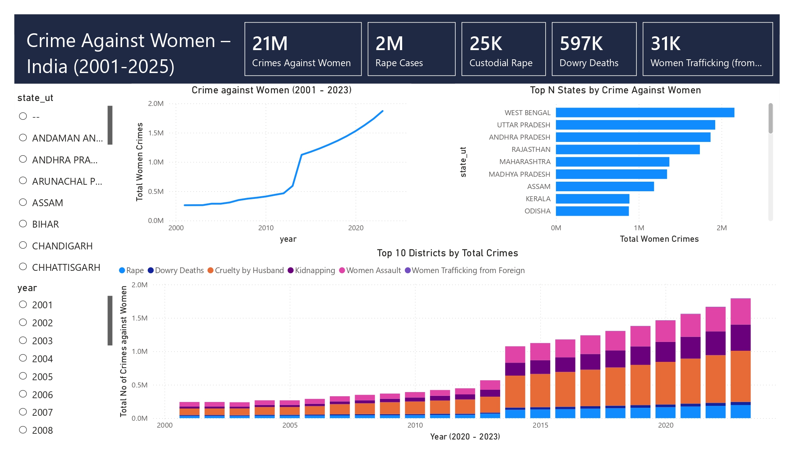
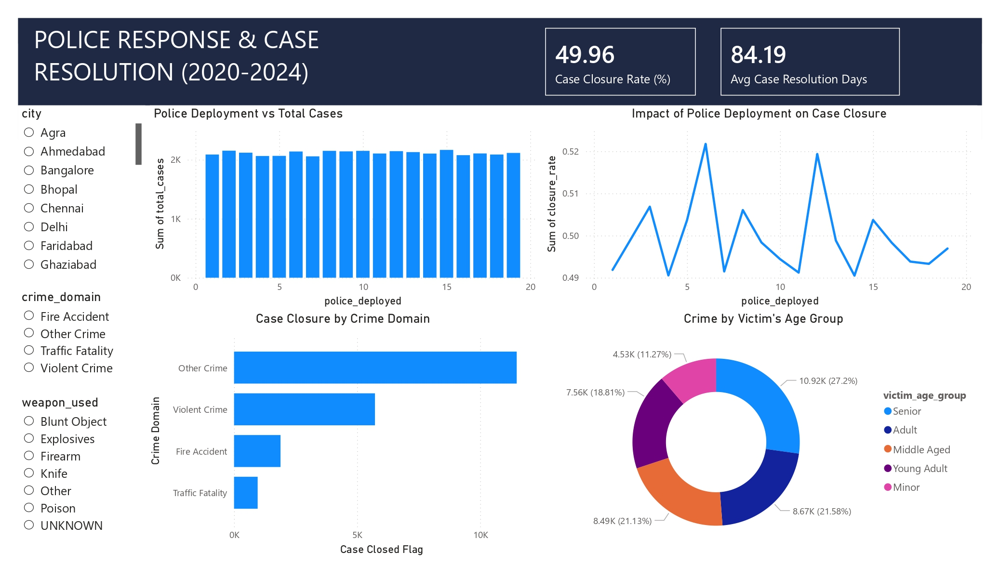
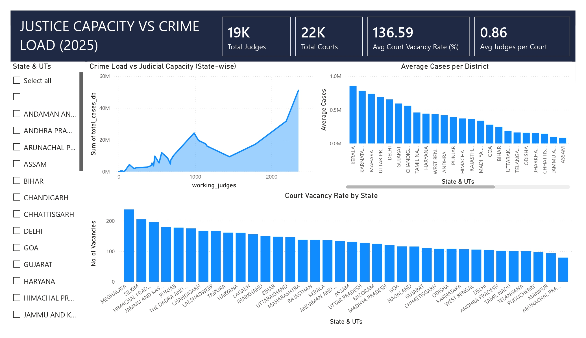

# CRIME IN INDIA: TEMPORAL TRENDS, SPATIAL PATTERNS, AND INSTITUTIONAL CONTEXT (2001–2025)

## Overview
This repository contains the source code and analytical workflow supporting a research study on crime trends in India over the period 2001–2025.

The work focuses on temporal patterns, spatial distribution, and institutional contextual analysis using publicly available and secondary datasets.

This repository is intended to support transparency, reproducibility, and methodological clarity. Final interpretations and conclusions are presented in the associated research publication.

---

## Data Sources
The analysis is based on officially published and secondary datasets, including:
- National Crime Records Bureau (NCRB) publications
- Census and demographic indicators
- Administrative and institutional datasets
- GeoJSON shapefiles for Indian states and union territories

⚠️ **Raw datasets are not included in this repository** due to data usage restrictions and ethical considerations.  
Only processed and aggregated data suitable for reproducibility are shared.

---

## Methodology
The study adopts a multi-stage crime analytics framework integrating temporal, spatial, and institutional perspectives.

The methodology consists of:
1. Data collection from official and secondary sources
2. Data cleaning, harmonization, and aggregation at state and year levels
3. Exploratory data analysis (EDA) to identify preliminary patterns
4. Temporal trend analysis to examine long-term crime dynamics
5. Spatial analysis using GIS-based state-wise mapping
6. Institutional analysis incorporating judicial and governance indicators
7. Visualization and interpretation using Python libraries and Power BI

The complete analytical workflow is illustrated in the research methodology framework.

### Research Methodology Framework



The figure presents the integrated research framework employed for analyzing crime trends in India, covering data sources, preprocessing stages, analytical dimensions, and visualization outputs.

---
## Power BI Analytical Dashboards

### Dashboard 1: Crime Analysis Overview (2001–2025)


### Dashboard 2: Crime Against Women


### Dashboard 3: Police Response and Crime Resolution


### Dashboard 4: Justice Capacity and Crime Load


> Dashboard visuals are based on aggregated and anonymized data and are presented for academic and illustrative purposes only.

---
## Repository Structure
```
CRIME-IN-INDIA-2001-2025/
├── assets/                  # Figures, images, supplementary files
├── figures/                 # Generated plots, charts
├── notebooks/               # Jupyter notebooks
│   ├── Filtereddata/        # Processed datasets for reproducibility      
│   │       └── 2020_to_2024/
│   │       └── Year_2025_Month_Wise/
│   └── GeoJson-Data-of-Indian-States-master/
├── powerbi/                 # Power BI dashboards and PBIX files
└── README.md                # This file
```

## Reproducibility
To reproduce the analysis:
1. Clone this repository
2. Install required Python libraries
3. Run the Jupyter notebooks in logical sequence

Detailed dependency information will be provided in `requirements.txt`.

---

## Ethical Considerations
- No individual-level or personally identifiable information is used
- Data is analyzed at aggregated temporal and spatial levels
- The study adheres to ethical research practices in crime analysis

---

## Authors

**Sagar Maindola**  
Assistant Professor & PGT Computer Science / IP  
Researcher – Data Science Engineering  

**Prerna Doodraj**  
PGT Political Science  
Researcher – Political Science & Institutional Analysis

---

## Citation
Maindola, S., & Doodraj, P. (2026). CRIME IN INDIA: Temporal trends, spatial patterns, and institutional context (2001–2025). *IJCRT*. Advance online publication.
